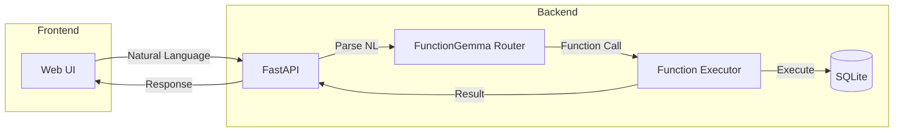

# AI-as-a-Backend Implementation Plan

Build two proof-of-concept applications demonstrating FunctionGemma as a natural language → function routing layer.

## User Review Required

> [!IMPORTANT]
> **Technology Stack Decision**: Plan uses FastAPI + SQLModel + vanilla HTML/JS frontend. Let me know if you prefer different choices.

> [!NOTE]
> **Model Loading**: FunctionGemma 270M will be loaded once at startup and kept in VRAM. With your 5060ti 16GB, you have plenty of headroom.

---

## Architecture Overview



**Flow:**
1. User types natural language in web UI
2. FastAPI receives request, sends to FunctionGemma
3. FunctionGemma outputs structured function call
4. Executor parses and runs the function
5. Result returned to user (optionally passed back to FunctionGemma for NL response)

---

## Shared Components

### [NEW] [project structure](file:///c:/Users/bukat/Desktop/AI-as-a-Backend)

```
AI-as-a-Backend/
├── docs/                     # Existing docs
├── shared/
│   ├── __init__.py
│   ├── gemma_router.py       # FunctionGemma wrapper
│   └── function_registry.py  # Tool registration decorator
├── todo_app/
│   ├── __init__.py
│   ├── main.py               # FastAPI app
│   ├── tools.py              # Tool definitions
│   ├── models.py             # SQLModel schemas
│   └── static/
│       └── index.html        # Simple UI
├── finance_app/
│   ├── __init__.py
│   ├── main.py               # FastAPI app
│   ├── tools.py              # Tool definitions
│   ├── models.py             # SQLModel schemas
│   └── static/
│       └── index.html        # UI with charts
├── pyproject.toml
└── README.md
```

---

### [NEW] [gemma_router.py](file:///c:/Users/bukat/Desktop/AI-as-a-Backend/shared/gemma_router.py)

Core wrapper for FunctionGemma that:
- Loads model once at startup
- Formats prompts with tool declarations
- Extracts function calls from output
- Handles the full cycle (NL → function call → execute → NL response)

```python
class GemmaRouter:
    def __init__(self, model_id: str = "google/functiongemma-270m-it"):
        # Load model and processor
        
    def register_tool(self, func: Callable) -> None:
        # Register a function as available tool
        
    def route(self, user_input: str) -> FunctionCall:
        # Parse NL → return structured function call
        
    def execute_and_respond(self, user_input: str) -> str:
        # Full cycle: NL → execute → NL response
```

---

## Project 1: Todo List

### Function Definitions

| Function | Arguments | Description |
|----------|-----------|-------------|
| `create_task` | `title: str`, `due_date?: str`, `priority?: str` | Create a new task |
| `list_tasks` | `status?: str`, `priority?: str` | List tasks with optional filters |
| `complete_task` | `task_id: int` or `title: str` | Mark task as done |
| `delete_task` | `task_id: int` or `title: str` | Remove a task |
| `update_task` | `task_id: int`, `title?: str`, `due_date?: str`, `priority?: str` | Update task details |

### Example NL → Function Mappings

| User Input | Expected Function Call |
|------------|------------------------|
| "Add buy milk to my list" | `create_task{title: "buy milk"}` |
| "Remind me to call mom tomorrow" | `create_task{title: "call mom", due_date: "tomorrow"}` |
| "What do I need to do?" | `list_tasks{}` |
| "Show me urgent tasks" | `list_tasks{priority: "high"}` |
| "I finished the shopping" | `complete_task{title: "shopping"}` |
| "Remove all completed tasks" | `delete_task{status: "completed"}` |

### [NEW] [models.py](file:///c:/Users/bukat/Desktop/AI-as-a-Backend/todo_app/models.py)

```python
class Task(SQLModel, table=True):
    id: int | None = Field(default=None, primary_key=True)
    title: str
    status: str = "pending"  # pending, completed
    priority: str = "normal"  # low, normal, high
    due_date: datetime | None = None
    created_at: datetime = Field(default_factory=datetime.utcnow)
```

---

## Project 2: Financial Tracker

### Function Definitions

| Function | Arguments | Description |
|----------|-----------|-------------|
| `add_expense` | `amount: float`, `category: str`, `description?: str`, `date?: str` | Record spending |
| `add_income` | `amount: float`, `source: str`, `description?: str`, `date?: str` | Record earnings |
| `add_recurring` | `type: str`, `amount: float`, `category: str`, `frequency: str` | Set up recurring transaction |
| `get_balance` | `period?: str` | Get current balance or for period |
| `get_spending` | `period: str`, `category?: str` | Query spending by period/category |
| `get_summary` | `period: str` | Full income/expense breakdown |

### Example NL → Function Mappings

| User Input | Expected Function Call |
|------------|------------------------|
| "Spent 50 dollars on groceries" | `add_expense{amount: 50, category: "groceries"}` |
| "Got paid 3000 from work" | `add_income{amount: 3000, source: "salary"}` |
| "Coffee 5 bucks" | `add_expense{amount: 5, category: "food"}` |
| "I pay 1200 rent every month" | `add_recurring{type: "expense", amount: 1200, category: "rent", frequency: "monthly"}` |
| "How much did I spend this week?" | `get_spending{period: "this_week"}` |
| "Show me my grocery spending for January" | `get_spending{period: "january", category: "groceries"}` |
| "What's my balance?" | `get_balance{}` |
| "Monthly summary" | `get_summary{period: "this_month"}` |

### [NEW] [models.py](file:///c:/Users/bukat/Desktop/AI-as-a-Backend/finance_app/models.py)

```python
class Transaction(SQLModel, table=True):
    id: int | None = Field(default=None, primary_key=True)
    type: str  # expense, income
    amount: float
    category: str
    description: str | None = None
    date: datetime = Field(default_factory=datetime.utcnow)
    
class RecurringTransaction(SQLModel, table=True):
    id: int | None = Field(default=None, primary_key=True)
    type: str  # expense, income
    amount: float
    category: str
    frequency: str  # daily, weekly, monthly, yearly
    next_date: datetime
    active: bool = True
```

---

## Fine-Tuning Strategy (Phase 4)

With your **5060ti 16GB**, fine-tuning FunctionGemma 270M is very feasible:

| Metric | Estimate |
|--------|----------|
| Model size (fp16) | ~540MB VRAM |
| Training batch size | 8-16 |
| Training time | ~1-2 hours for 1000 examples |

### Training Data Generation

1. Collect usage logs from both apps
2. Create dataset of `(user_input, expected_function_call)` pairs
3. Include edge cases where base model fails
4. Use Hugging Face PEFT/LoRA for efficient fine-tuning

### Recipe
Follow [Google's fine-tuning cookbook](https://github.com/google-gemini/gemma-cookbook/blob/main/FunctionGemma/%5BFunctionGemma%5DFinetune_FunctionGemma_270M_for_Mobile_Actions_with_Hugging_Face.ipynb) adapted for our tools.

---

## Verification Plan

### Automated Tests

1. **Unit tests** for each tool function
2. **Integration tests** for FunctionGemma routing:
   ```python
   @pytest.mark.parametrize("input,expected", [
       ("add buy milk", "create_task"),
       ("how much did i spend", "get_spending"),
   ])
   def test_routing(input, expected):
       result = router.route(input)
       assert result.function_name == expected
   ```

3. **Accuracy benchmark**: Track % of correct function calls

### Manual Verification

1. **Browser testing** of web UIs
2. **Edge case testing** with ambiguous inputs
3. **Performance metrics**: latency, VRAM usage

---

## Implementation Order

1. **Shared components first** (`gemma_router.py`, `function_registry.py`)
2. **Todo List app** (simpler, validates architecture)
3. **Financial Tracker** (more complex queries)
4. **Compare results**, identify gaps
5. **Fine-tune if needed**

---

## Questions for You

1. **Start with which project?** I'd suggest Todo List first as it's simpler to validate the architecture.
2. **Frontend preference?** Plan is vanilla HTML/JS. Want React/Vue instead?
3. **Any specific categories** you want pre-defined for the financial tracker (groceries, rent, entertainment, etc.)?
